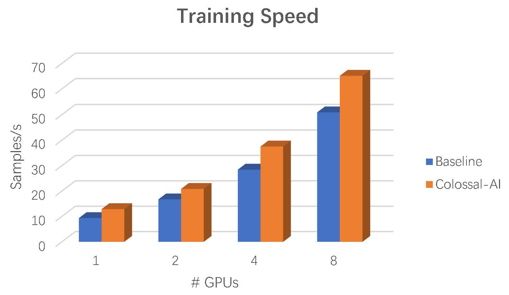
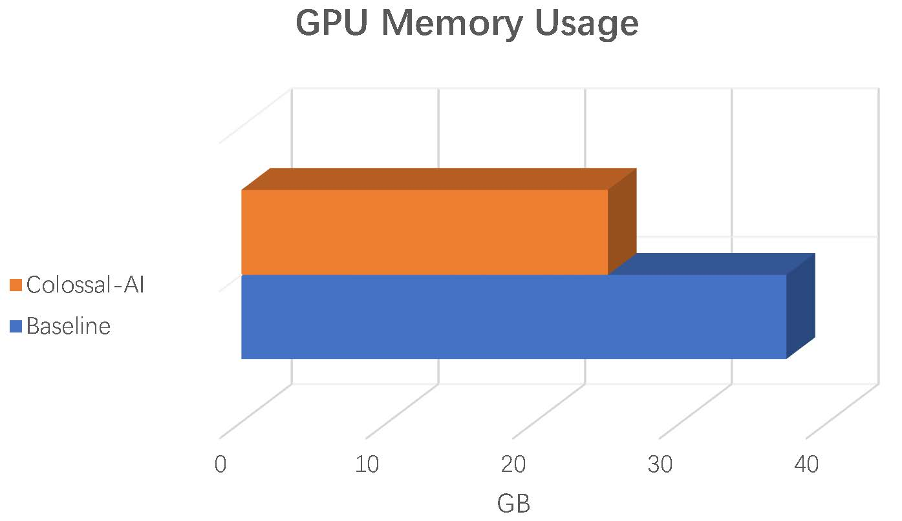

# UniTAB with Colossal-AI

This repo is forked from [UniTAB](https://github.com/microsoft/UniTAB), which support train by [ColossalAI](https://github.com/hpcaitech/ColossalAI)(Colossal-AI: A Unified Deep Learning System for Big Model Era)

## Installation

New conda env:

```shell
conda create -n unitab python=3.8
conda activate unitab
```

Clone the repository:

```shell
git clone https://github.com/microsoft/UniTAB.git
cd UniTAB
```

Install Dependencies

```shell
cd
git clone https://github.com/NVIDIA/apex
cd apex
pip install -v --disable-pip-version-check --global-option="--cpp_ext" --global-option="--cuda_ext" .

cd
git clone https://github.com/hpcaitech/ColossalAI.git
cd ColossalAI
pip install -v -e .
```

Install other packages in ``requirements.txt`` (separately install [numpy](https://pypi.org/project/numpy/) and [pytorch (LTS 1.8.2)](https://pytorch.org/get-started/locally/) if fails):

```shell
pip install -r requirements.txt
```

## Data

* Please follow the [instructions in the official repo](https://github.com/microsoft/UniTAB#data) to download at least the Flickr30k dataset

## Pre-train

### Baseline

The config file for pretraining is ``configs/pretrain.json``.

Example command (#GPUs=8):

```shell
git checkout baseline

CUBLAS_WORKSPACE_CONFIG=:4096:8 torchrun --nproc_per_node=8 main.py \
    --dataset_config configs/pretrain.json \
    --batch_size 2 \
    --lr_backbone 2e-5 \
    --text_encoder_lr 2e-5 \
    --lr 1e-4 \
    --num_queries 200 \
    --max_decoding_step 256 \
    --do_caption \
    --no_detection \
    --unitab_pretrain \
    --pretrain_seqcrop mixed \
    --ema
```

### Using Colossal-AI

```shell
git checkout main

CUBLAS_WORKSPACE_CONFIG=:4096:8 torchrun --nproc_per_node=8 main.py \
    --dataset_config configs/pretrain.json \
    --batch_size 2 \
    --lr_backbone 2e-5 \
    --text_encoder_lr 2e-5 \
    --lr 1e-4 \
    --num_queries 200 \
    --max_decoding_step 256 \
    --do_caption \
    --no_detection \
    --unitab_pretrain \
    --pretrain_seqcrop mixed \
    --ema
```

## Performance

In overall, some optimized fused kernels in Colossal-AI are applied in order to improve the training performance.
Compared with the original implementation, Colossal-AI can achieve ~27% speedup as well as ~32% memory reduction.
<center class="half">
     
</center>

## Acknowledgement

The project is built based on the following repository:

* [UniTAB](https://github.com/microsoft/UniTAB)
* [MDETR--Modulated Detection for End-to-End Multi-Modal Understanding](https://github.com/ashkamath/mdetr),
* [transformers](https://github.com/huggingface/transformers).
* [ColossalAI](https://github.com/hpcaitech/ColossalAI)
